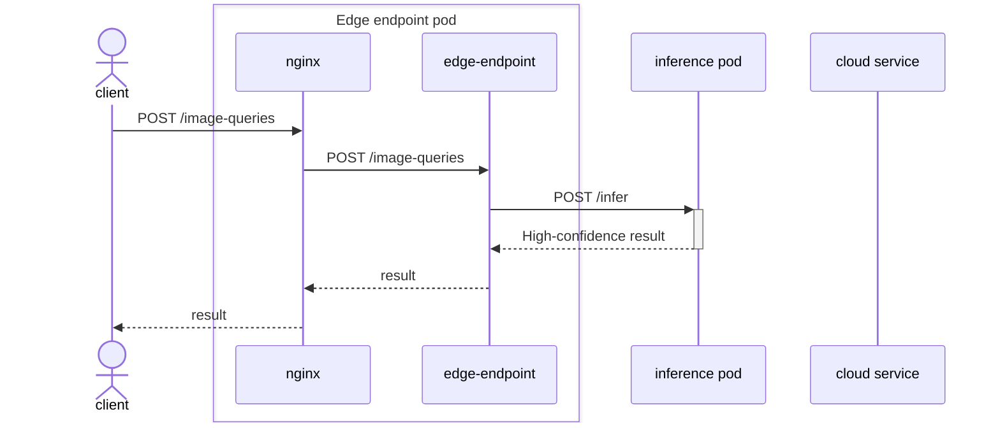
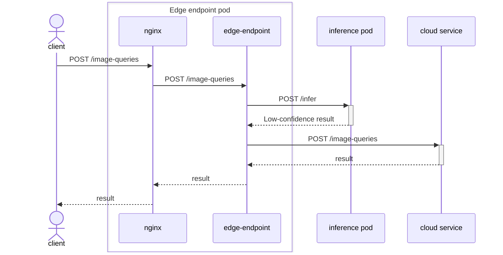
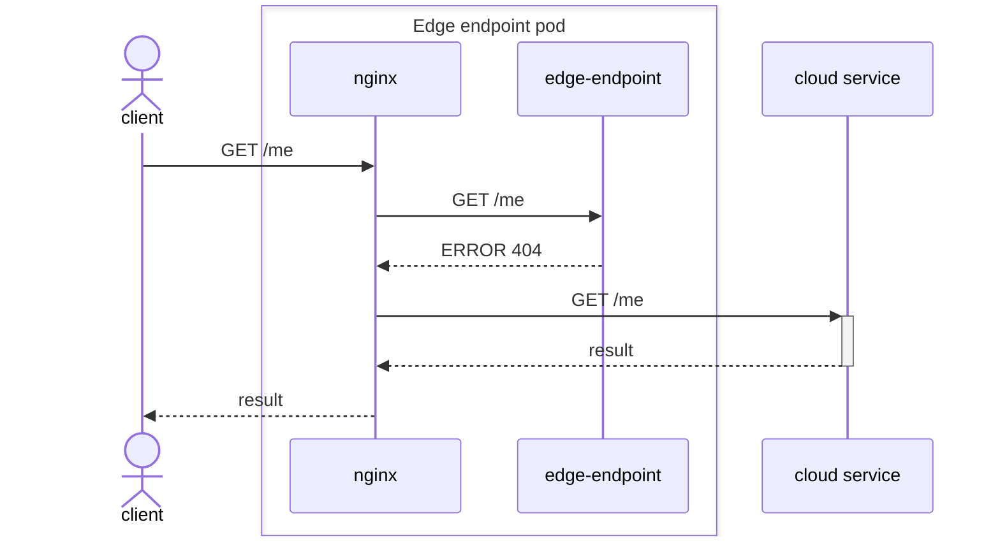

# Edge endpoint architecture

## Overview

The edge endpoint provides a way for clients to use the existing Groundlight API in a hybrid mode: most inference requests will be handled locally while all other requests will be forwarded to the Groundlight cloud service.

## Structure

The edge endpoint is implemented as a set of Kubernetes resources (defined by the helm chart in the [helm directory](deploy/helm/groundlight-edge-endpoint/)).

There is a single pod for the main logic of the edge endpoint and one pod for each inference model.

The edge endpoint pod divides its work between three containers:

| Container               | Function                                                                                                                                                           |
| ----------------------- | ------------------------------------------------------------------------------------------------------------------------------------------------------------------ |
| Edge Endpoint           | Handle inference requests and determine whether to handle them locally or send them to the cloud.                                                                  |
| Inference Model Updater | Keep track of which models are in use, download the latest model data, and start pods to serve inference on those models, updating to the latest models regularly. |
| Status Monitor          | Aggregate usage stats and upload them to the cloud periodically.                                                                                                   |

## Network flow

By default, the edge endpoint exposes the Groundlight API on port 30101 on the local machine.

How URLs are handled:

| URL                               | Verb(s) | Handled by                           |
| --------------------------------- | ------- | ------------------------------------ |
| `/image-queries`                  | `POST`  | Edge endpoint, may escalate to cloud |
| `/health/live` `/health/ready` | `GET`   | Edge endpoint                        |
| `/ping`                           | `GET`   | Edge endpoint                        |
| `/status`                         | `GET`   | Status monitor                       |
| all others                        | all     | Forward to cloud                     |

The nginx server will always try to send API calls to the the edge endpoint first. If the edge endpoint cannot handle the request, it will forward it to the cloud service using the nginx fallback mechanism. The following sequence diagrams illustrate the process of handling requests:

Local inference 

Local inference with escalation 

Forward unsupported URL to cloud 

## Inference requests

## Communication between the edge endpoint containers

