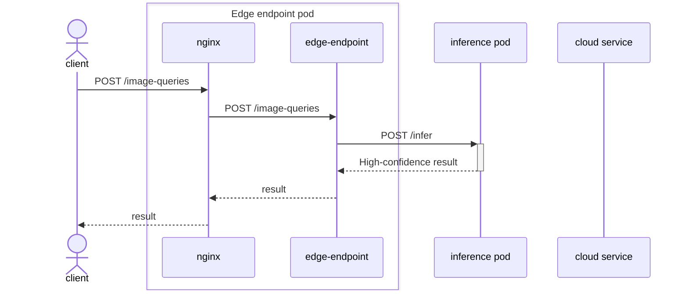
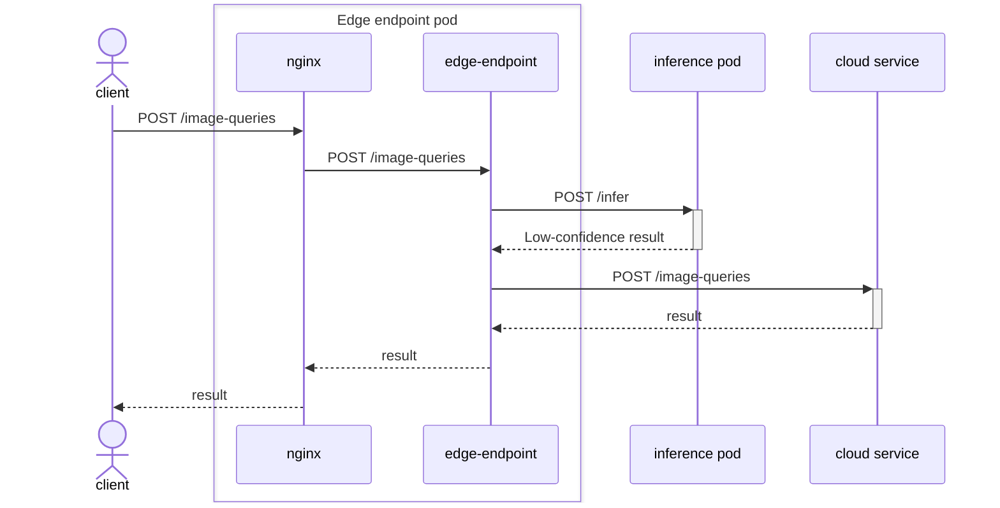
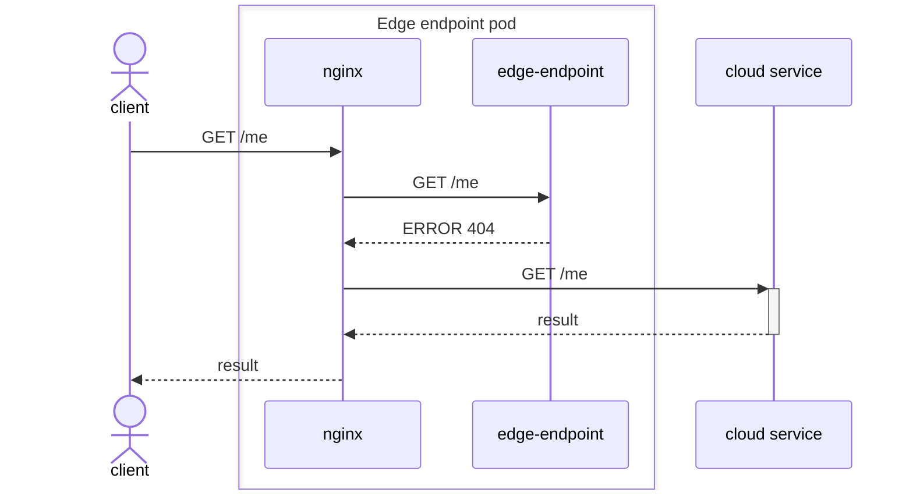
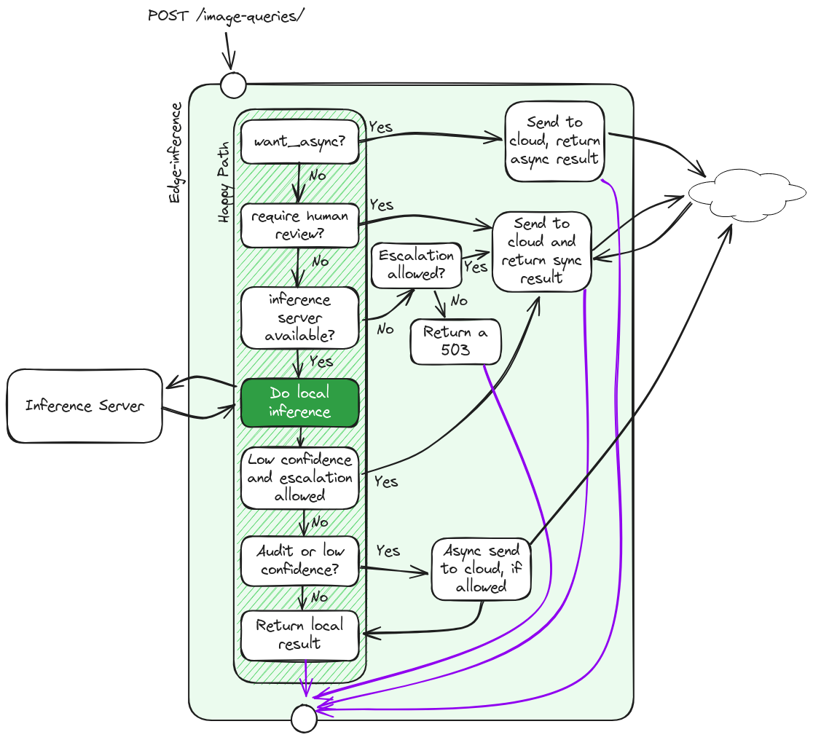

# Edge endpoint architecture

## Overview

The edge endpoint provides a way for clients to use the existing Groundlight API in a hybrid mode: most inference requests will be handled locally while all other requests will be forwarded to the Groundlight cloud service. This enables client programs to get low-latency results for most requests while still being able to use the full Groundlight API.

## Structure

The edge endpoint is implemented as a set of Kubernetes resources (defined by the helm chart in the [helm directory](deploy/helm/groundlight-edge-endpoint/)).

There is a single pod for the main logic of the edge endpoint and one pod for each inference model.

By default, there are currently two models for each detector: a __primary__ model that answers the query and an out-of-domain detection (__OODD__) model that tells us that something has changed in the image that may mean that the primary model will no longer be effective. Each of these models is served by its own pod, so there are two inference pods for each detector.

When running in minimal mode, out of domain detection is performed within the primary inference model. Only a single model pod per detector is required when the edge endpoint is run in minimal mode.

The edge endpoint pod divides its work between five containers:

| Container               | Function                                                                                                                                                |
| ----------------------- | ------------------------------------------------------------------------------------------------------------------------------------------------------- |
| nginx                   | Receive all API requests and route them appropriately.                                                                                                  |
| Edge Endpoint           | Receive inference requests and determine whether to handle them locally or send them to the cloud.                                                      |
| Inference Model Updater | Keep track of which models are in use, download model data, and start pods to serve inference on those models, updating to the latest models regularly. |
| Status Monitor          | Aggregate usage stats and upload them to the cloud periodically.                                                                                        |
| Escalation Queue Reader | Monitor the file-based queue and escalate queued escalations.                                                                                           |

## Network flow

By default, the edge endpoint exposes the Groundlight API on port 30101 on the local machine.

The following diagram shows how HTTP requests are handled by the edge endpoint when not running in minimal mode.

In minimal mode, the HTTP request path is largely the same, but only a single inference pod is used.

(The inference model updater does not handle any requests. See below in [Communication between the edge endpoint containers](#communication-between-the-edge-endpoint-containers) for more details.)

How URLs are handled:

| URL                               | Verb(s) | Handled by                           |
| --------------------------------- | ------- | ------------------------------------ |
| `/image-queries`                  | `POST`  | Edge endpoint, may escalate to cloud |
| `/health/live` `/health/ready` | `GET`   | Edge endpoint                        |
| `/ping`                           | `GET`   | Edge endpoint                        |
| `/status`                         | `GET`   | Status monitor                       |
| all others                        | all     | Forward to cloud                     |

The nginx server will always try to send API calls to the the edge endpoint first. If the edge endpoint cannot handle the request (i.e., it returns HTTP error 404 `Page not found`, 405 `Method not allowed`, or 422 `Unprocessable Content`), nginx will use its fallback mechanism to forward the call to the cloud service. 

The edge endpoint container handles all inference requests (`POST /image-queries`) and will either send them to a local inference pod or escalate them to the cloud directly (see [Inference Requests](#inference-requests)) below for more details.

The following sequence diagrams illustrate the process of handling requests:

#### Local inference 

#### Local inference with escalation 

#### Forward unsupported URL to cloud 

## Inference requests

The general idea of the inference request flow is that the edge endpoint will handle most requests locally, but if the confidence of the result is low, it will escalate the request to the cloud service. 

However, there are a number of special cases to consider:
- Async inference requests are always sent to the cloud.
- If the edge endpoint is not able to handle the request locally (e.g. the model is not available), it will forward the request to the cloud service.
- If escalation is not allowed (by the configuration), the endpoint will always handle the request locally, even if the confidence is low. If there is no local model available, the request will return an error (this will always happen on the first inference attempts if the model was not pre-loaded by the configuration).
- Randomly selected requests where local inference was confident will be sent to the cloud to audit and improve the model, assuming escalation is allowed.
- If the user has configured the edge endpoint to always return the local result, the edge endpoint will always return the local result, even if it's low-confidence. If escalation is allowed, the low-confidence image query will be escalated to the cloud asynchronously for labeling and training purposes. (This option is good for clients that always need low-latency results, but still want to improve the model over time.)

For details on configuring these options, see the page [CONFIGURING DETECTORS](CONFIGURING-DETECTORS.md).

Asynchronous and failed synchronous escalations will be written to the escalation queue and subsequently escalated by the queue reader. See the page [ESCALATION QUEUE](ESCALATION-QUEUE.md) for more information.

The following diagram shows the flow of inference requests:

## Communication between the edge endpoint containers

While the normal inference and API requests use HTTP to communicate between the various parts of the service, there are two other types of communication that are used internally:
1. When the edge endpoint container gets an inference request for a detector that it hasn't seen before, it creates rows in a SQLite database to track the model and its status. The inference model updater container will then see these rows and start new inference pods for the corresponding models. When the pods are started, the inference model updater will update the rows in the database to indicate that the model is ready and edge endpoint can start using it. 
2. Edge endpoint writes usage statistics to files in the file system (per process and per unit time). The status monitor container will read these files periodically and upload the statistics to the cloud service. It can also serve real-time statistics as a simple web page.

These mechanisms have an important advantage over HTTP in that they are durable and represent the current state rather than events. This makes it easy to handle process restarts and intermittent connectivity.

The following diagram shows the communication flow between the containers with these mechanisms:

Additionally, the `edge-endpoint` container writes to the escalation queue via a file-based queue system. See [ESCALATION QUEUE](ESCALATION-QUEUE.md) for more information.
