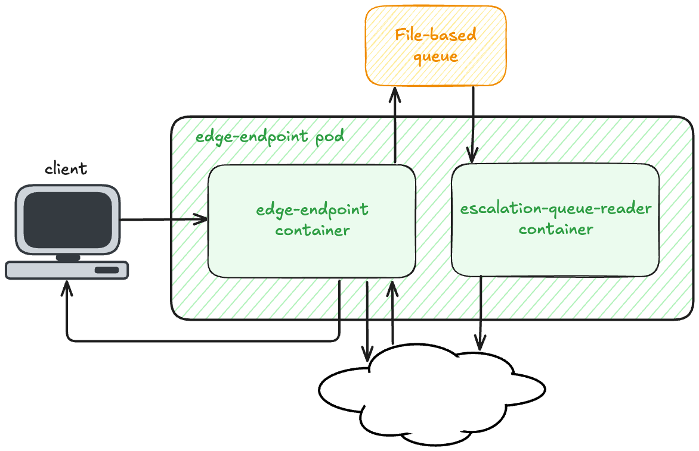
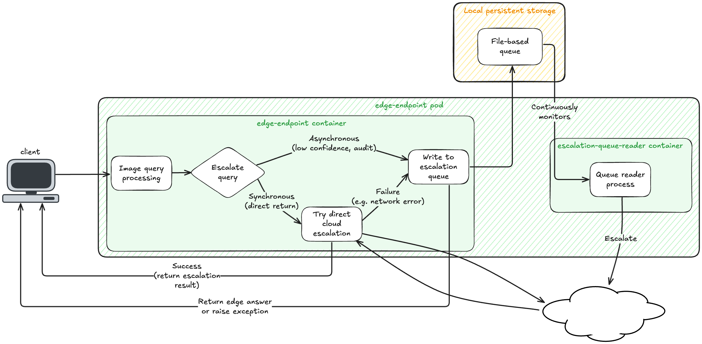

# Escalation Queue

## Overview

The escalation queue ensures that image queries escalated from the edge will eventually make it to the cloud, even in the case of temporary network outages. The `escalation-queue-reader` container in the `edge-endpoint` pod runs a single-threaded process which continuously monitors the file-based queue for new entries. When it sees a queued item it attempts to escalate it to the Groundlight cloud service, retrying the request when applicable (see [Retrying failed escalations](#retrying-failed-escalations)).

Escalations from the queue are entirely asynchronous and the resulting response from the cloud is never surfaced to the client. Escalations are written to the queue when either a) a synchronous escalation attempt fails or b) the edge answer is returned but the query is escalated to the cloud in the background due to low confidence or an audit. See [Escalation flow](#escalation-flow) below for more detail.

## Escalation flow

The diagram below shows a high level flow of escalations within the edge endpoint:

There are two types of escalation: synchronous and asynchronous.

A synchronous escalation occurs when the edge endpoint needs to escalate an image query to the cloud in order to fulfill the client's request (e.g., if the detector is using `default` configuration and the edge answer was below the confidence threshold). In this case the worker in the `edge-endpoint` container that is answering the client's request will make a synchronous/blocking `submit_image_query` request to the cloud. If the image query is successfully submitted, the resulting `ImageQuery` is returned to the client. If the escalation request fails, the worker writes the escalation to the queue so that it can be retried in the background.

An asynchronous escalation is done when the edge endpoint is going to return an image query created on the edge to the client but there's reason for the image query to also be escalated to the cloud. This happens in two cases: either a) if the edge answer is confident but the query is randomly selected for an audit or b) if the edge answer is unconfident but will be returned to the client anyways due to the detector configuration. In either of these cases, the worker in the `edge-endpoint` container will write the escalation to the queue before returning a response to the client. 

The below table summarizes this logic:

| Type of escalation | Reason                                             | Writes to queue? |
| :----------------- | :------------------------------------------------- | :--------------: |
| Synchronous        | Need cloud answer to fulfill client request        | Only on failure  |
| Asynchronous       | Unconfident edge answer or random audit  |       Yes        |

In the `escalation-queue-reader` container, a separate process continuously monitors the queue and attempts to escalate the queued items.

The following diagram shows a more detailed flow:

## Retrying failed escalations

If an escalation fails, we want to retry the request if we think it might eventually succeed and give up otherwise.

How we interpret errors:

| Exception                                  | Retry? | Explanation |
| :--------------------------------------    | :----: | :---------- |
| `GroundlightClientError` (on client init)  | Yes    | Client initialization failed (often no internet or transient SDK/client issue). We retry since it may start working again (e.g., when connectivity returns). |
| `FileNotFoundError` (on image load)        | No     | Image file is missing, so we can't submit the image query. |
| `MaxRetryError`                            | Yes    | SDK exhausted HTTP retries (likely network issue); we retry because the request could succeed when the network comes back. |
| `HTTPException (400 Bad Request)`          | No     | Bad request (often a duplicate escalation or invalid request parameters); the request will not succeed even if retried. |
| `HTTPException (429 Too Many Requests)`    | Yes    | Throttled; once enough time passes, the request should succeed. |
| `HTTPException (other status)`             | No     | Unknown HTTP error; unknown whether a retry would help. |
| `Exception` (any other)                    | No     | Unexpected error; unknown whether a retry would help. |
