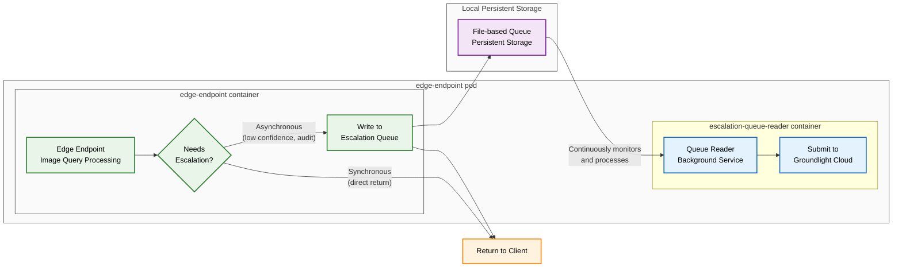

# Escalation Queue

## Overview

The escalation queue provides a persistent, reliable mechanism for handling image query escalations to the Groundlight cloud service. When the edge endpoint determines that a query needs escalation (due to low confidence results, audit sampling, or failed direct escalations), it writes the escalation request to a local file-based queue for background processing.

## Architecture

The escalation queue system operates across two containers within the edge-endpoint pod:

## Key Features

### Persistence
- Escalations are stored in local persistent storage that survives container restarts
- Queue processing can resume after interruptions without losing escalation requests

### Asynchronous Processing
- Client requests return immediately after queue writing (non-blocking)
- Background container continuously processes queued escalations
- Separates fast request handling from slower cloud communication

### Reliability
- File-based queue with atomic operations prevents data loss
- Retry logic with exponential backoff handles network failures
- Duplicate detection prevents processing the same request multiple times

## Components

- **edge-endpoint container**: Handles main API requests and writes escalations to queue
- **escalation-queue-reader container**: Background service that reads from queue and submits to cloud
- **Local Persistent Storage**: File-based queue storage shared between containers
