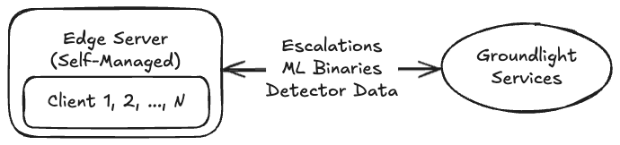

# Networking Requirements

## Overview

Groundlight Edge Endpoint allows you to run Groundlight's ML models locally on your edge devices, reducing latency and increasing throughput. Additionally, inference requests handled on the edge are not counted towards your account's usage limits. Currently, Groundlight provides three ways of deploying edge endpoint:

- [Self-Managed Edge Server](#self-managed-edge-server)
- [Balena-Managed Devices](#balena-managed-devices)
- [Edge on the Cloud](#edge-on-the-cloud)

Depending on the deployment methods, there may be additional networking requirements that need to be added to the allowlist in your infrastructure so that the endpoint can communicate with our service.

## Network Requirements

### Basic Requirements

Groundlight edge endpoint requires the following outbound access:

- `*.groundlight.ai`: Groundlight endpoint for receiving detector metadata
- `*.us-west-2.amazonaws.com`: AWS access for inference image download
- `*.s3.amazonaws.com`: AWS access for model binaries download
- `*.sts.amazonaws.com`: AWS authentication
- `*.huggingface.co`: Model download
- `*.hf.co`: Hugging Face CDN
- `*.docker.io`: Docker image download
- `*.docker.com`: Docker image download

The device must also be able to reach DNS and NTP servers either on the local network (provided by DHCP or Static assignment), or on the Internet (ports 53 and 123).

There may be additional network requirements based on the deployment methods, please refer to the next section for any additional inbound/outbound access that will need to be added to the allowlist.

### Self-Managed Edge Server

For self managed edge servers where the client is not in the same machine as the edge endpoint, inbound port `30101` to the server is the default port for our SDK to communicate with the edge server.

For client application running on the same machine, no outbound port access is needed as the client can access the edge endpoint through `ENDPOINT=http://localhost:30101` or its internal IP address.

### Balena-Managed Devices

For balena-managed edge servers, additional outbound access is required for communicating with balena's cloudlink service:

- `*.balena-cloud.com`

For more information, please refer to balena's networking documentation [here](https://docs.balena.io/reference/OS/network/#network-requirements).

For balena-managed edge servers where the client is not in the same machine as the edge endpoint, inbound port `30101` to the server is the default port for our SDK to communicate with the edge server.

For client application running on the same machine, no outbound port access is needed as the client can access the edge endpoint through `ENDPOINT=http://localhost:30101` or its internal IP address.

### Edge on the Cloud

For our edge-on-the-cloud services, an outbound allowlist to port `30101` and the IP address of the edge server is required on the client side. On the server side please refer to the [Basic Requirements](#basic-requirements).